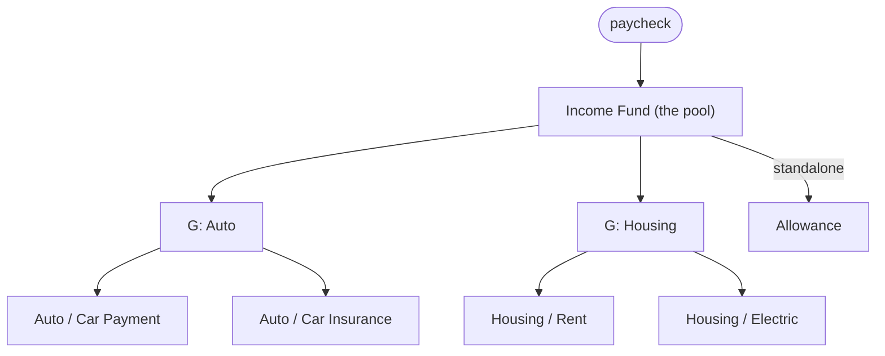
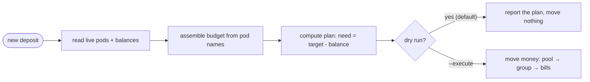

# maestro

A declarative budgeting engine for the [Sequence](https://getsequence.io) platform.
Name your pods to a simple convention and maestro computes how to fund your bills
each paycheck — and can execute the transfers — replacing the sprawling, hand-tuned
rule trees you'd otherwise maintain by hand.

> **Personal project, cautious by default.** It runs **dry-run** unless you pass
> `--execute`, and even then a rollout phase (`shadow` → `groups` → `full`) gates how
> much it actually moves. The funding math is unit-tested. Built around one real
> account; not yet generalized for arbitrary setups.

## The idea

Sequence lets you automate money with rules, but expressing a real budget means a
fan-out of chained rules with hand-calculated amounts (`top up Housing to $2,000,
Auto to $500, …`) you keep in sync by hand. Add a bill and you're editing
several rules and redoing arithmetic.

maestro flips that: the **pod name is the spec**. Name a pod

```
Auto / Car Payment / 500 / 15
```

and the engine knows it's a $500 bill in the **Auto** group, due the 15th. It reads
all your pods, builds the budget model from their names, reads live balances, and
computes the funding plan — group totals, per-paycheck shares, due-date timing, all
derived. Add a bill = name one pod. Nothing else to maintain.

Once your pods are named, money flows pool → group pods → bills:



## Naming

The pod **name** is the spec — maestro parses it; there's no config file. Set it up in
two steps: **create your group pods first, then name your bill pods.**

### Group pods (create these first)

A group is a single pod named `G: <Group>` — `G: Auto`, `G: Home`. It's the one control
point for everything in that group: money flows `pool → group pod → bill pods`, and the
group's total and per-paycheck pull are **derived** from its member bills (never typed).

```
G: Auto
G: Home
```

Create the `G:` pod **before** the bills that name it. If a bill references a group that
has no `G:` pod, maestro still funds the bill — but straight from the pool, and `run`
warns you (`no group pod for 'Auto' — funding its bills from the pool`), so you lose that
group's single control point. Groups are optional: a 3-field bill with no group is funded
directly from the pool.

### Bill pods

Each bill is a pod whose name follows this grammar:

```
[Group /] Name / Amount / DueDay [/ Frequency]      # due on a day of the month
[Group /] Name / Amount / Frequency                 # no due day — funded evenly over the period
[Group /] Name / Amount / drawdown / Date / Period  # save toward a dated lump, then repeat
```

| Field | Meaning |
|---|---|
| `Group` | *(optional)* the bill's group — must match a `G: <Group>` pod (above). Omit it (3 fields) for a standalone bill funded straight from the pool. |
| `Name` | the bill's name — an inner `/` must have **no** surrounding spaces |
| `Amount` | dollars: `600` or `134.50`, no `$` |
| `DueDay` | `1`–`31`, or `last` for end of month |
| `Frequency` | `month` (default), `quarter`, `year`, or `topup` — aliases like `monthly` / `yearly` / `annual` accepted |

The delimiter is `" / "` (space-slash-space), so a name like `Water/Trash` stays one field.

- **`topup`** tops the pod up to `Amount` each paycheck, measured from the ledger (deposits since the last payday) — for pods that get spent down, so it won't refill spending or double-fund.
- **`drawdown`** (`Health / Dentist / 600 / drawdown / 2026-09-15 / 6mo`) saves a flat slice each paycheck toward a dated lump, then rolls the date forward by the period (`mo` / `y`).
- Pods that don't match the grammar — savings, debt-routing, the income pool — are **ignored** by the funding logic.

A few worked examples — the comment after each shows how the name decodes:

```
Auto / Car Payment / 500 / 15                  # $500 due the 15th, in the "Auto" group
Housing / Rent / 2000 / 1                      # $2,000 due the 1st, in "Housing"
Memberships / Warehouse Club / 60 / 10 / year  # $60 once a year, due the 10th, in "Memberships"
Utilities / Electric / 100 / last              # $100 due the last day of the month, in "Utilities"
Allowance / 200 / month                        # $200/month — no group (funded from the pool), no due day (spread evenly)
```

## How funding works

Each paycheck, every bill is funded

```
(amount still needed) ÷ (paychecks remaining before its due date)
```

So a monthly bill gets ~50% per paycheck and reaches 100% by its due date — and if
it's ever behind, or a due date is closing in, the share automatically rises to cover
it in time. Other frequencies spread the funding over the right number of paychecks.
Money flows `pool → group → bills`, with group totals computed from their member
bills. On a short paycheck it rations what's there — soonest-due first — instead of
overdrawing.

End to end, each cycle:



## Usage

Requires the [Rust toolchain](https://rustup.rs) (`cargo`) and a `SEQUENCE_API_KEY`
in the environment (a local `.env` works). Build with `cargo build --release` (the
binary lands at `target/release/maestro`). One binary, `maestro`, with subcommands:

```bash
maestro discover          # onboard once: detect pay cadence, income pool(s), typical amounts → maestro.json
maestro run               # a funding cycle — reports the plan + full pod accounting, moves nothing
maestro run --execute     # the same cycle, but actually move the money
maestro accounts          # account + balance snapshot
maestro tx <filter>       # recent transfers for pods matching a name
maestro rules [filter]    # inspect Sequence rules and the amounts they move
maestro rebalance         # level sinking-fund pods to pace (--execute to move)
maestro simulate --deposit 1000 --date 2026-07-15   # what-if a deposit on a date, moves nothing
maestro daemon            # long-running: watch for deposits, fund on arrival (report-only)
maestro daemon --execute  # same, but move money when a deposit is detected
```

Dry run is the default everywhere; `--execute` (or `MAESTRO_DRY_RUN=false`) is the
only difference from a real run — the computation is identical. `run` accounts for
*every* pod — what it funds, what it can't yet (and why), what's still on old naming,
and what it ignores — so nothing is silently dropped. (During development,
`cargo run -- <command>`.)

`maestro run` prints the whole plan — every pod accounted for:

```
MAESTRO — 2026-06-15  [DRY RUN — moves nothing]
pay schedule: SemiMonthly { days: [15, -1] }   strategy: SoonestDue
pool: Income Fund = $2500.00   buffer: 2.5%   phase: Shadow

=== Auto ===
  Car Payment            have   $500.00  target   $500.00  need     $0.00  fund     $0.00
  Car Insurance          have    $60.00  target    $60.00  need     $0.00  fund     $0.00
=== Housing ===
  Rent                   have  $1000.00  target  $1000.00  need     $0.00  fund     $0.00
  Electric               have    $50.00  target    $50.00  need     $0.00  fund     $0.00
=== Memberships ===
  Warehouse Club         have    $55.00  target    $50.00  need     $0.00  fund     $0.00  ahead $5.00
=== Health ===
  Dentist                have    $80.00  target   $150.00  need    $70.00  fund    $50.00  [drawdown — behind pace, no catch-up]
=== (ungrouped) ===
  Allowance              have   $100.00  target   $100.00  need     $0.00  fund     $0.00
  Groceries              have     $0.00  target   $400.00  need   $400.00  fund   $400.00  [top-up — owes this pay]

ahead of pace $5.00  ·  behind $0.00
net $5.00 reclaimable → reclaim pod (run `maestro rebalance`)

notes:
    Dentist: $80 saved toward $600 by 2026-09-15 — ~$70 behind pace (top up to catch up, optional)

ignored — not bills (3): Emergency Fund, Savings, Vacation
```

### Daemon

`maestro daemon` runs continuously (e.g. in a container). It watches your income
source(s) and runs a funding cycle when a new deposit lands — all scheduling
in-process, no cron — and serves a small HTTP surface a UI can hang off:

| Endpoint | Purpose |
|---|---|
| `GET /health` | liveness/readiness probe |
| `GET /status` | last cycle summary (JSON) |
| `POST /run` | trigger a cycle now |

The boot snapshot is *always* report-only; money moves only on a detected deposit.
Tunables: `MAESTRO_BIND` (default `0.0.0.0:8080`), `MAESTRO_INTERVAL_SECS` (poll
cadence), `MAESTRO_PHASE` (`shadow` / `groups` / `full`), `MAESTRO_BUFFER_PCT`
(safety cushion on bill targets). Logs via `tracing` (`RUST_LOG` to adjust).

## Layout

| Path | What |
|---|---|
| `src/model.rs` | budget types (groups, bills) |
| `src/schedule.rs` | pay schedule — any cadence, enumerates real paydays |
| `src/allocator.rs` | the pure funding math + rationing (fully unit-tested) |
| `src/derive.rs` | parse pod names → the model |
| `src/budget.rs` | assemble the live budget from pods + the onboarding state |
| `src/engine.rs` | one funding cycle: read, plan, then report or execute (the single real path) |
| `src/state.rs` | the generated onboarding state (`maestro.json`) |
| `src/config.rs` | environment-driven configuration |
| `src/main.rs` | the `maestro` binary (clap subcommands) |
| `src/commands/` | subcommands: `discover`, `cycle` (run), `finances` (accounts), `tx`, `rules`, `rebalance`, `simulate`, `daemon` |

Built on [sequence-rs](https://github.com/myst3k/sequence-rs). No database and no
stored rules: the pod names and your live balances are the only source of truth, so
the plan is recomputed fresh every time and safe to run as often as you like.

## License

Dual-licensed under [MIT](LICENSE-MIT) or [Apache-2.0](LICENSE-APACHE), at your option.
